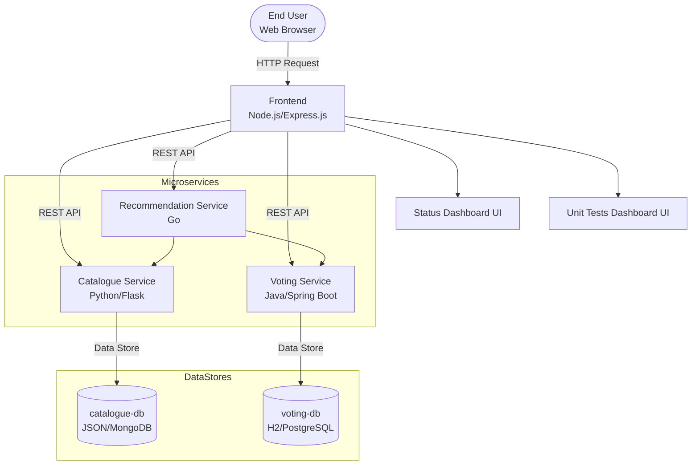

```mermaid
flowchart TD
    User([End User<br>Web Browser])
    User -->|HTTP Request| FE[Frontend<br>Node.js/Express.js]
    FE -->|REST API| CAT[Catalogue Service<br>Python/Flask]
    FE -->|REST API| VOTE[Voting Service<br>Java/Spring Boot]
    FE -->|REST API| REC[Recommendation Service<br>Go]
    CAT -->|Data Store| CATDB[(catalogue-db<br>JSON/MongoDB)]
    VOTE -->|Data Store| VOTEDB[(voting-db<br>H2/PostgreSQL)]
    REC --> CAT
    REC --> VOTE
    FE --> FEStatusUI[Status Dashboard UI]
    FE --> FEUnitTestUI[Unit Tests Dashboard UI]

    %% Optional: Grouping (visual only, not strict in Mermaid)
    subgraph Microservices
        CAT
        VOTE
        REC
    end
    subgraph DataStores
        CATDB
        VOTEDB
    end
```
