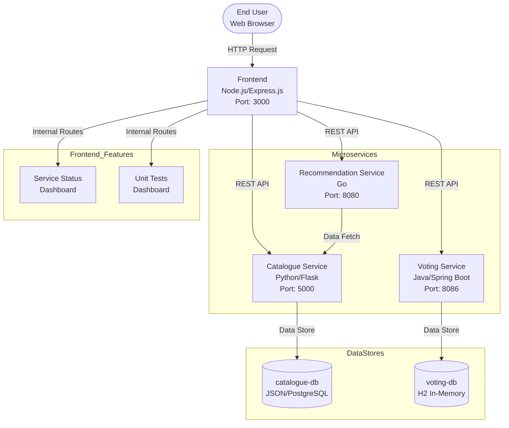

```mermaid
flowchart TD
    User([End User<br>Web Browser])
    User -->|HTTP Request| FE[Frontend<br>Node.js/Express.js<br>Port: 3000]
    FE -->|REST API| CAT[Catalogue Service<br>Python/Flask<br>Port: 5000]
    FE -->|REST API| VOTE[Voting Service<br>Java/Spring Boot<br>Port: 8086]
    FE -->|REST API| REC[Recommendation Service<br>Go<br>Port: 8080]

    CAT -->|Data Store| CATDB[(catalogue-db<br>JSON/PostgreSQL)]
    VOTE -->|Data Store| VOTEDB[(voting-db<br>H2 In-Memory)]
    REC -->|Data Fetch| CAT

    FE -->|Internal Routes| FEStatus[Service Status<br>Dashboard]
    FE -->|Internal Routes| FEUnitTests[Unit Tests<br>Dashboard]

    %% Grouping
    subgraph Microservices
        CAT
        VOTE
        REC
    end
    subgraph DataStores
        CATDB
        VOTEDB
    end
    subgraph Frontend_Features
        FEStatus
        FEUnitTests
    end
```
